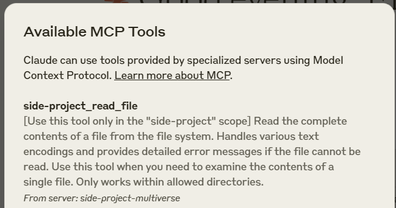

# Multiverse MCP Server

[](https://smithery.ai/server/@lamemind/mcp-server-multiverse)

A middleware server that enables multiple isolated instances of the same MCP servers to coexist independently with unique namespaces and configurations.

The Multiverse MCP Server creates isolated operational spaces where identical MCP servers can run simultaneously without conflicts. Each "universe" maintains its own configuration, filesystem access, and function naming, enabling developers to run multiple instances of the same server type while maintaining complete separation between different contexts or projects.

## Key Features

### Run Multiple Instances
Run multiple instances of the same MCP server type independently and simultaneously. Each instance operates in its own isolated universe with separate configurations. This enables scenarios like:
- Multiple MySQL servers `mcp-server-mysql` pointing to different databases
- Multiple Git servers `mcp-server-git` with different Personal Access Tokens
- Multiple filesystem servers `mcp-server-filesystem` accessing different root paths

### Automatic Server Restart
Register your MCP server with file watching capability during development. When enabled, the server automatically detects changes in the specified directory and performs a graceful restart, making development and testing seamless.

### JSON-based Configuration System
Define your multiverse setup using a simple and flexible JSON configuration format. Each server instance can be configured with its own:
- Command and arguments
- Environment variables
- Path resolution rules
- File watching settings

## Installation

### Installing via Smithery

To install Multiverse MCP Server for Claude Desktop automatically via [Smithery](https://smithery.ai/server/@lamemind/mcp-server-multiverse):

```bash
npx -y @smithery/cli install @lamemind/mcp-server-multiverse --client claude
```

### Installing manually

First, ensure you've downloaded and installed the [Claude Desktop app](https://claude.ai/download) and you have npm installed.

Next, add this entry to your `claude_desktop_config.json` 
- on Mac, found at `~/Library/Application\ Support/Claude/claude_desktop_config.json`
- on Windows, found at `C:\Users\<username>\AppData\Roaming\Claude\claude_desktop_config.json`

Now add how many multiverse servers you want to run. For example, if you want to run two instances of `mcp-server-multiverse`, one for your job and one for your side project, you can add the following configuration:

```json
{
  "mcpServers": {
    "job-multiverse": {
      "command": "npx",
      "args": [
        "-y",
        "@lamemind/mcp-server-multiverse@latest",
        "/path/to/your/job-multiverse.json"
      ]
    },
    "side-project-multiverse": {
      "command": "npx",
      "args": [
        "-y",
        "@lamemind/mcp-server-multiverse@latest",
        "/path/to/your/side-project-multiverse.json"
      ]
    }
  }
}
```

This config allows Claude Desktop to automatically start the `mcp-server-multiverse` instances when you start the app.



## Configuration Examples

### Create two isolated instances of `mcp-server-mysql` with different databases

Your `job-multiverse.json` file
~~~JSON
{
  "serverName": "JobMultiverse",
  "functionsPrefix": "job",
  "servers": [
    {
      "command": "npx",
      "args": [
        "-y",
        "@benborla29/mcp-server-mysql"
      ],
      "env": {
        "MYSQL_HOST": "127.0.0.1",
        "MYSQL_PORT": "3306",
        "MYSQL_USER": "root",
        "MYSQL_PASS": "",
        "MYSQL_DB": "my-job-db"
      }
    }
  ]
}
~~~

Your `side-project-multiverse.json` file
~~~JSON
{
  "serverName": "SideProjectMultiverse",
  "functionsPrefix": "side-project",
  "servers": [
    {
      "command": "npx",
      "args": [
        "-y",
        "@benborla29/mcp-server-mysql"
      ],
      "env": {
        "MYSQL_HOST": "127.0.0.1",
        "MYSQL_PORT": "3306",
        "MYSQL_USER": "root",
        "MYSQL_PASS": "",
        "MYSQL_DB": "side-project-db"
      }
    }
  ]
}
~~~


### Create an isolated instance of `mcp-server-filesystem`

- The `mcp-server-filesystem`'s functions will be exposed with `side-project` prefix, e.g. `side-project_read_file`, `side-project_write_file`.
- The root path can be hidden from the client (e.g. Claude Desktop) by using the `pathResolution` configuration.

Note that `pathResolution` is optional and is only needed if you want to hide the root path from the client.

Your `multiverse.json` file
~~~JSON
{
  "serverName": "MySideProject",
  "functionsPrefix": "side-project",
  "servers": [
    {
      "command": "npx",
      "args": [
        "-y",
        "@modelcontextprotocol/server-filesystem@latest",
        "/full/path/to/side-project"
      ],
      "pathResolution": {
        "root": "/full/path/to/side-project",
        "applyTo": [
          "path",
          "paths"
        ]
      }
    }
  ]
}
~~~


### Automatic server restart on file changes with `fileWatch`

Your `multiverse.json` file
~~~JSON
{
  "serverName": "MySideProject",
  "functionsPrefix": "side-project",
  "servers": [
    {
      "command": "node",
      "args": [
        "/my-own/mcp-server/i-m-working-on/build/index.js"
      ],
      "fileWatch": {
        "enabled": true,
        "path": "/my-own/mcp-server/i-m-working-on/build/"
      }
    }
  ]
}
~~~

### Hiding specific functions with the `hideFunctions` option

You can selectively hide specific functions from wrapped servers using the `hideFunctions` array. This is useful when you want to use a server but restrict access to certain potentially dangerous or unnecessary functions.

The `hideFunctions` array accepts a list of function names that should be hidden from the wrapped server. When a function is hidden:
- It won't be registered with the main MCP server
- It won't be available to the client (e.g., Claude Desktop)
- It won't appear in the list of available functions

This feature is particularly useful for:
- Restricting access to potentially dangerous functions (e.g., `delete_repository` in GitHub)
- Simplifying the interface by hiding rarely used functions
- Creating different permission levels for different server instances

~~~JSON
{
  "serverName": "GitHubWithRestrictions",
  "functionsPrefix": "github",
  "servers": [
    {
      "command": "npx",
      "args": [
        "-y",
        "@modelcontextprotocol/server-github@latest"
      ],
      "env": {
        "GITHUB_PERSONAL_ACCESS_TOKEN": "<your-personal-access-token>"
      },
      "hideFunctions": [
        "create_repository",
        "delete_repository",
        "create_issue"
      ]
    }
  ]
}
~~~

In this example, the GitHub server will start normally, but the functions `create_repository`, `delete_repository`, and `create_issue` will be hidden and unavailable to the client.


### Disabling specific servers with the `enabled` flag

You can selectively disable specific servers in your configuration without removing them from the JSON file by setting the `enabled` flag to `false`. This is useful for temporarily disabling servers during development or testing.
~~~JSON
{
  "serverName": "MySideProject",
  "functionsPrefix": "side-project",
  "servers": [
    {
      "command": "npx",
      "args": [
        "-y",
        "@modelcontextprotocol/server-filesystem@latest",
        "/full/path/to/side-project"
      ],
      "hideFunctions": [ "write_file" ]
    },
    {
      "enabled": false,
      "command": "npx",
      "args": [
        "-y",
        "@modelcontextprotocol/server-github@latest"
      ]
    }
  ]
}
~~~

In this example, the first server (filesystem) will start but the function `write_file` has been hidden, the second server (GitHub) is disabled and won't be started.

### Full example of a `multiverse.json` file

This example demonstrates how to create a multiverse server with multiple instances of different server types.

Note that `pathResolution` is optional and is only needed if you want to hide the root path from the client.

~~~JSON
{
  "serverName": "HugeProjectWithALotOfResources",
  "functionsPrefix": "huge-project",
  "servers": [
    {
      "command": "node",
      "args": [
        "/my-own/mcp-server/i-m-working-on/build/index.js"
      ],
      "fileWatch": {
        "enabled": true,
        "path": "/my-own/mcp-server/i-m-working-on/build/"
      }
    },
    {
      "command": "npx",
      "args": [
        "-y",
        "@modelcontextprotocol/server-filesystem@latest",
        "/full/path/to/huge-project"
      ],
      "pathResolution": {
        "root": "/full/path/to/huge-project",
        "applyTo": [
          "path",
          "paths"
        ]
      }
    },
    {
      "command": "npx",
      "args": [
        "-y",
        "@modelcontextprotocol/server-github@latest"
      ],
      "env": {
        "GITHUB_PERSONAL_ACCESS_TOKEN": "<your-personal-access-token>"
      }
    },
    {
      "command": "uvx",
      "args": [
        "mcp-server-git",
        "--repository",
        "/full/path/to/huge-project"
      ],
      "pathResolution": {
        "root": "/full/path/to/huge-project",
        "applyTo": [
          "repo_path"
        ]
      }
    }
  ]
}
~~~

## To Do

- [ ] Add support for `Prompts`
- [ ] Add support for `Resources`
- [ ] Add a GUI for managing multiverse servers

## Verified Platforms

- [x] Windows
- [ ] macOS
- [ ] Linux

## License

MIT
